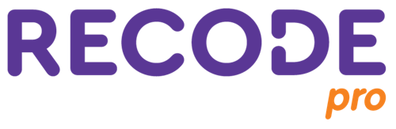

 

      

  <a href ="#rocket-o-projeto">Projeto</a>  •
  <a href ="#dart-proposta">Proposta</a>  •
  <a href ="#hourglass_flowing_sand-planejamento-de-entregas">Planejamento</a>  •
  <a href ="#calendar-os-sprints">Sprints</a>  •
  <a href ="#camera_flash-as-versões">Versões do site</a>  •
  <a href ="#computer-tecnologias-utilizadas">Tecnologias</a>  •
  <a href ="#bulb-metodologia-utilizada">Metodologia</a>  •
  <a href ="#bar_chart-backlog-do-projeto">Backlog</a>  •
  

<h1 align="center">
  1ª fase do projeto desenvolvido no ano de 2022 entre 16 de maio à 01 agosto pelos estudantes do Squad 44 da Recode Pro 2022.
<h1 align="center">
 
      
## :rocket: O Projeto

* A ideia para a plataforma surgiu a partir de um problema: a falta de interesse pela escola (desafio 2). Uma das formas encontradas para intervir, e ajudar no desenvolvimento das crianças autistas é criar uma plataforma gameficada por meio de um site customizado com as melhores práticas para atender esse público, e, oportunidades de experimentar e se desenvolver o universo da aprendizagem e descobrir o quanto ele pode ser amplo e diversificado, possibilitando o aumento do interesse acadêmico do aluno em prosseguir seus estudos para níveis acadêmicos superiores.

 

## :dart: Proposta
**Criação de uma plataforma que desenvolva as crianças austistas e que aumente seu interesse em permanecer na escola.**

 

## :camera_flash: Apresentação da 1ª do Projeto

**:link: Clique no link abaixo para visualizar o site hospedado:**
>  [http://www.edutismo.com.br](https://sitesegundaentrega.vercel.app/) mudar vídeo

  

## :hourglass_flowing_sand: Planejamento de Entregas
      
- [x] [SPRINT 1] - 13/06/2022 a 18/06/2022

 

## :calendar: Os Sprints

☑️ SPRINT 1 ([Link da Pasta](https://github.com/renato-wessmer/Edutismo/tree/main/SPRINT_01): Concluído :heavy_check_mark:

  

## :computer: Tecnologias Utilizadas

            

 

* **Front-end:** HTML, CSS e JavaScript              
* **Ferramentas:** Visual Studio Code
* **Comunicação:** Discord, Whatsapp

 

## :mortar_board: Colaboradores 

|Nome|
| -------- |
|**Amauri Luiz da Silva**|
|**Jonnas Targino Macedo Conegundes**|
|**Letícia Pereira do Nascimento**|
|**Priscila Renata Santos de Souza**|
|**Renato Wéssmėr**|
|**Vitória Oliveira Costa**|

 

<h1 align="center"> </h1>   